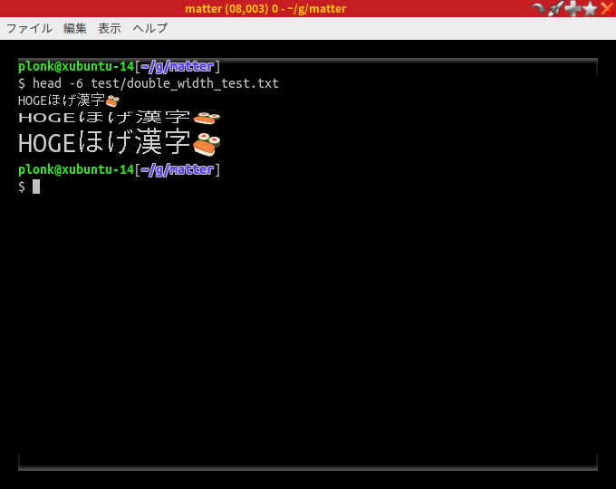

# 概要

Electron で作った端末エミュレータです。

# ビルド

* Electron を入れます。
* `npm install --runtime=electron --target=1.4.3 --disturl=https://atom.io/download/atom-shell --abi=50`
* `bower install`

# 起動

* `electron .`

# バグ・制限

* 画面を極端に小さくするとエラーが起こります。
* Ctrl+C で SIGINT を発生させられません。どうして？
